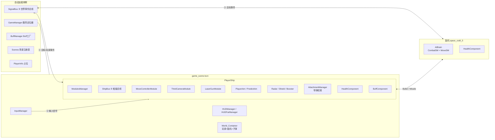
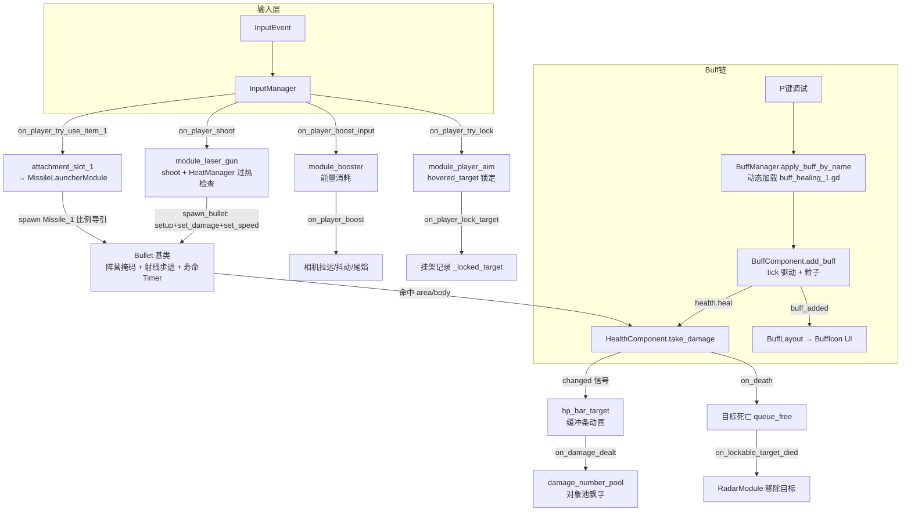

# test-1 项目代码地图 (Code Map)

> Godot 4.6 / Forward Plus · 太空空战原型
> 玩家飞船(模块化组装)+ 敌机 AI 状态机 + 激光/导弹武器 + HUD/Buff 系统
> 主视口 1920×1080,`canvas_items` 拉伸,max_fps 144

---

## 1. 总体架构

项目采用 **模块化飞船 + 组件 + 两级事件总线** 的架构:

- **自动加载单例**(5 个)提供全局服务:世界级事件总线、服务定位器、Buff 工厂、场景注册表。
- **飞船 = ModulesManager 容器 + 一堆 Module**(飞控/相机/武器/雷达/瞄准/护盾…),模块在 `PlayerShip._ready` 中动态安装。
- **组件**(HealthComponent / BuffComponent)以 Area3D/Node 形式挂在任意载具上,实现 ECS 风格复用。
- **两级事件总线**(三级通信模型,见 `.memo/.CURRENT.md` §2.2):③ 世界级 `SignalBus`(autoload)承载目标出生/死亡/伤害/玩家注册等"不依附单船"事件;② 船级 `ShipBus`(PlayerShip 子节点)承载同船输入/状态(含 hover)。InputManager 把输入动作翻译后经玩家船 ShipBus 发布。



---

## 2. 目录结构

```
test-1/
├─ project.godot              # 输入映射、autoload、物理层命名
├─ scenes/                    # 所有 .tscn(见 §5)
│  ├─ modules/                # 飞船模块场景
│  ├─ hud/                    # 准星/目标选择框/目标血条
│  ├─ component/              # 组件场景(血量/可锁定)
│  ├─ attachment/             # 挂件场景
│  ├─ state_machine/          # AI_Brain 装配场景
│  ├─ ui/                     # 飘字/Buff图标/面板
│  └─ particles/              # 流星/治疗粒子
├─ scripts/
│  ├─ AutoLoad/               # 自动加载单例(见 §3)
│  ├─ Manager/                # 场景内管理器(输入/HUD/UI/飘字池)
│  ├─ module/                 # 模块化飞船系统(base/core/modules,见 §4.1)
│  ├─ component/              # ECS 风格组件(见 §4.2)
│  ├─ buff/                   # Buff 系统(见 §4.3)
│  ├─ ai/                     # 敌机 AI 状态机(见 §4.4)
│  ├─ bullet/                 # 弹道(见 §4.5)
│  ├─ attachment/             # 挂件系统(见 §4.6)
│  ├─ hud/                    # 准星类控件
│  ├─ ui/                     # UI 控件(血条/飘字/特效)
│  ├─ MyClass/                # 可观察数值资源 / HUD 分组
│  ├─ static/                 # 静态工具(阵营枚举/日志)
│  ├─ compositor/             # RD 计算着色器后处理
│  ├─ shader_node/            # 自定义 VisualShader 节点
│  ├─ tool/ test/             # 测试用脚本
│  └─ Main.gd / character_body_3d.gd 等散落脚本
├─ shader/                    # 天空/描边/速度线/UI shader
├─ material/ UI_material/     # StandardMaterial3D 与 UI 材质
├─ blender_export/            # Blender 导出 glb + PBR 贴图
├─ audio/ font/ textures/ svg/ gradient_tex/ style/ font_style/
└─ script_templates/          # Buff / State 新建脚本模板
```

---

## 3. 自动加载单例(project.godot `[autoload]`)

| 单例 | 脚本 | 职责 |
|---|---|---|
| **PlayerInfo** | `scripts/AutoLoad/player_info.gd` | 目前仅 `dead_zone_px := 16.0`(鼠标死区半径),占位 |
| **SignalBus** | `scripts/AutoLoad/SignalBus.gd` | ③ 世界级事件总线,纯信号声明:仅 `on_player_registered` / `on_lockable_target_spawned/died` / `on_damage_dealt`(② 船级信号已迁 ShipBus,见 §6.1) |
| **BuffManager** | `scripts/AutoLoad/buff_manager.gd` | 约定式 Buff 工厂:`apply_buff_by_name(target, source, buff_id, duration)` 按 `res://scripts/buff/buff_<id>.gd` 动态加载,图标约定 `res://textures/icon/icon_buff_<id>.png`;`get_buff_component(target)` / `get_all_active_buffs(target)` |
| **Scenes** | `scripts/AutoLoad/my_scenes.gd` | 场景预加载注册表:全部 module_*.tscn、crosshair_1..4、hp_bar_target、dead_zone_indicator、导弹挂架等,运行时 `Scenes.xxx_scene` 引用 |
| **GameManager** | `scripts/AutoLoad/GameManager.gd` | 服务定位器:持有 `player_instance / hud_manager / ui_manager / audio_manager / input_manager / main_scene`;`register_player()` 同时广播 `on_player_registered` |

> `scripts/AutoLoad/global.gd` 为空文件,未注册。

---

## 4. 核心系统

### 4.1 模块化飞船系统(`scripts/module/`)

**继承体系**:`Module(Node3D)`(决策 #26:统一 Node3D,纯逻辑模块 transform 恒等) → 各具体模块;`EngineModule` → `MoveControllerModule` / `BoosterModule`;`WeaponModule` → 激光机炮;`UIModule` → 基础信息 UI。模块子组件(`ModuleComponent`)回指 `main_module`。install 时 `ModulesManager` 显式注入 `root`/`modules_manager`/`ship_bus`(决策 #25/#27)。

| 模块 | class_name | 职责 |
|---|---|---|
| `modules_manager.gd` | `ModulesManager` | 模块容器:`install_module` 实例化并注入依赖、按类型缓存;`get_camera_module / get_aim_module / get_move_module / get_radar_module / get_radar_view`(决策 #27)查询 |
| `core/ship_bus.gd` | `ShipBus` | ② 船级事件总线(PlayerShip 子节点):只声明 10 条信号、零逻辑零状态(见 §6.1);模块经 install 注入,船外节点经 `on_player_registered` 取 `player.ship_bus` |
| `module_move_controller.gd` | `MoveControllerModule` | 飞行执行器(决策 #13):收归一化命令 `set_throttle(-1..1)`/`set_steer(Vector2)`/`set_roll(-1..1)`,做加减速/平滑转向/滚转/引擎开关;不读输入 |
| `module_booster.gd` | `Booster_1` | 推进器:能量条消耗/恢复(Timer tick)、粒子、`set_boosting(bool)` 命令(P3)、发 ② `ship_bus.on_player_boost` |
| `module_third_camera.gd` | `ThirdCameraModule` | 第三人称相机:鼠标跟随/自由视角、回头看、锁定目标平滑转向、加速 FOV/抖动/尾焰;反向发 ② `on_toggle_track_mouse` |
| `module_laser_gun.gd` | `LaserModule` | 激光机炮(P3 补 class_name):左右炮口交替、射速 Timer、过热停火、按热量加伤、`set_firing(bool)` 命令、`spawn_bullet()`;ModulesManager 缓存 `get_laser_module()` |
| `module_player_aim.gd` | `BasicAimModule` | 锁定系统:悬停**自判**(每帧拉 radar_view 缓存 `screen_rect` 命中测试,决策 #27)、RMB 锁定、发 ② `ship_bus.on_player_lock_target`;`aim_view` 持有锁定准星 |
| `module_predict_aim.gd` | `PredictAimModule` | 预测射击:二次方程解析拦截时间 `solve_intercept_time`,驱动 crosshair_4 与提前量标签 |
| `module_radar.gd` | `RadarModule` | 雷达:监听③可锁定目标出生/死亡,维护目标列表;`radar_view` 集中投影(方案 A) |
| `module_shield.gd` | `ShieldModule` | 护盾:受击球体淡入淡出、数值同步 UI、每秒回充 |
| `modules/brain/module_control.gd` | `ControlModule` | 玩家大脑(P3,决策 #28):每帧读 Input → 归一化命令(`set_throttle`/`set_steer`/`set_roll`/`set_boosting`/`set_firing`);鼠标死区/归一化在此;离散事件仍走 ② ShipBus |
| `module_hud.gd`(门面模块) | `HUDModule` | 集中管理所有模块 HUD 注册→转发 HUDManager(决策 #19);玩家固有面板 = `player_stats_view`;不做投影/悬停检测 |
| `module_component/heat_manager.gd` | `HeatManager` | 武器过热:每发加热、冷却 Timer、`overheated` 信号、热量条抖动 |
| `module_component/laser_gun_hud_system.gd` | `LaserGunHudSystem` | 机炮 HUD:注册 crosshair_3 与死区指示器 |
| `module_screen.gd` / `module_test.gd` | — | 空壳/占位 |

**基类**:`base/module.gd`(`Module extends Node3D`,`_enter_tree` 兜底缓存 `modules_manager`/`root`/`ship_bus`,正常由 install 显式注入)、`base/module_engine.gd`、`base/module_booster.gd`(链式子模块 `_enter_tree` 兜底从父模块取 `modules_manager`/`root`/`ship_bus`)、`base/module_weapon.gd`(bullet_speed + `on_bullet_speed_change`)、`base/module_UI.gd`、`base/module_component.gd`。

### 4.2 组件(`scripts/component/`)

| 组件 | class_name | 职责 |
|---|---|---|
| `health_component.gd` | `HealthComponent` | 血量组件(本身是 hurtbox Area3D):`setup(team, hp, max)`、`take_damage/heal/reset`、信号 `changed(new, max, delta)` 与 `on_death` |
| `buff_component.gd` | `BuffComponent` | Buff 容器:按名存 `active_buffs`,每帧 `buff.update(delta)`,管理 buff 粒子,信号 `buff_added/buff_removed` |
| `move_component.gd` | `MoveComponent` | 预留(内容全注释) |

### 4.3 Buff 系统(`scripts/buff/`)

- `base/buff_base.gd`(`Buff`, RefCounted):tick 间隔/持续时间/叠层(ADD 枚举)/过期方式(IMMEDIATELY / ONE_STACK / GRADUALLY),由 BuffComponent 驱动 `update()`。
- `buff_healing_1.gd`:唯一实现,每 0.1s 回 1 血,持续 2s。
- 新建 Buff 可用模板 `script_templates/Node/buff_template.gd`。

### 4.4 敌机 AI(`scripts/ai/`)

**结构**:`AIBrain` 收集并驱动子级状态机;`StateMachine` 基类以子节点为状态,`transition_to(index)` 切换;`State` 基类持有 player/ship 引用。

| 状态机 | 状态 |
|---|---|
| `combat_state_machine.gd` (`CombatSM`) | `state_idle`(机头 30° 锥角且 <800m 转 ATTACK)、`state_attack`(弹速前置量预判开火) |
| `move_state_machine.gd` (`MoveSM`) | `orbit` 螺旋绕后 · `chase` 咬尾(100-200m) · `intercept` 侧方拦截 · `evade` 受击急转 · `joust` 正面对冲 · `disengage` 脱离 |

MoveSM 提供公共机动原语:`rotate_towards / move_forward / set_target_speed`。

### 4.5 弹道(`scripts/bullet/`)

- `base/bullet_base.gd`(`Bullet`, Area3D):`setup(pos, dir, team, shooter)` 链式配置;**按阵营动态分配碰撞掩码**(玩家不打自己人);每帧射线步进 `_check_ray_collision` 防高速穿透 + `area_entered` 双通道命中;寿命 Timer;`_is_destroyed` 防重复命中。
- `bullet_1.gd`(`LaserBullet`):直线激光弹,damage 10 / speed 500。
- `missile.gd`(`Missile_1`):**比例导引导弹**——点火延迟后按 LOS 变化率 × N 值修正航向,受 `turn_speed` 限制,加速至 `max_speed`,`set_target()` 锁定目标。

### 4.6 挂件系统(`scripts/attachment/`)

- `slot/slot.gd`(`Slot`):`SLOT_1..4` 枚举 + `on_active` 信号;`attachment_slot_1.gd` 经 `on_player_registered` 连玩家船 ShipBus 的 `on_player_try_use_item_1` → active。
- `base/attachment.gd`(`Attachment`):setup 缓存 owner 与槽位。
- `attachment_missile_launcher.gd`(`MissileLauncherModule`):经 `on_player_registered` 连玩家船 ShipBus 的 `on_player_lock_target`,发射 `Missile_1` 并继承载具初速。

### 4.7 HUD / UI

**管理器(`scripts/Manager/`)**:

| 管理器 | 职责 |
|---|---|
| `input_manager.gd` (`InputManager`) | 输入中枢(P3 起 = 离散事件翻译器):输入动作 → 玩家船 ShipBus 信号(②,toggle/hold 两种模式),转发鼠标事件;shoot/boost 连续量已由 ControlModule 接管,不再经信号;玩家未注册(bus 为 null)时安全丢弃 |
| `HUD_manager.gd` (`HUDManager`) | HUD 注册中心:统一 `register_hud(element) -> HudElement`(element 可为 PackedScene 或 Node;归属由元素 `@export hud_slot: HudElement.Slot` 自声明,默认 GROUP);持有 4 个 UI 特效节点 |
| `hud_far_manager.gd` (`HUDFarManager`) | 远 HUD 层:每帧计算机头前方 1000m 点的屏幕投影 `nose_pos_2d`、鼠标位置、是否在屏 |
| `damage_number_pool.gd` | 伤害飘字对象池(预建 20 个 Label),监听 `on_damage_dealt` |
| `attachment_manager.gd` (`AttachmentManager`) | 按 Slot 把挂件实例化到槽位并 `setup(player_ship)` |
| `ui_manager.gd` (`UIManager`) | 主 UI 层(空壳,含 Main_Menu/Transition_Rect) |

**准星(`scripts/hud/`)**:`target_selector`(白色目标选择框,**纯显示**——radar_view 每帧喂入屏幕位置/尺寸,方案 A)、`lock_reticle`(绿色二级锁定框)、`gun_reticle`(绿色机炮十字,限制在死区圆周)、`lead_indicator`(绿色预测圆圈,`_draw` 按距离插值半径)、`dead_zone_indicator`(死区圆);基类 `base/hud_far_base.gd`(→ `HudElement` 元件基类);全部带 class_name(`HUD_TargetSelector`/`HUD_LockReticle`/`HUD_GunReticle`/`HUD_LeadIndicator`/`HUD_DeadZoneIndicator`),消费方类型化静态调用,无 `.call()`/Dictionary 鸭子类型。
**目标 UI 簇(P1/P2)**:`target_reticle.gd`(`TargetReticle`,一个目标 = 一个组件,持有选择框+目标血条并统一生命周期);由 `radar_view.gd`(`RadarView`,radar 模块场景内子节点)监听③ `on_lockable_target_spawned/died` 按目标 spawn/回收;**每帧集中投影缓存 `_rect_cache: {target: Rect2}`**(单一数据源:喂 selector 显示 + 供 aim 命中判定,决策 #27);悬停检测在 `module_player_aim`(每帧拉 rects 自判,变化才发脉冲),高亮经 ② `ship_bus.on_target_hovered/unhovered` 回传 radar_view。旧 `target_reticle_controller.gd` 已删除。

**UI 控件(`scripts/ui/`)**:`hp_bar`(缓冲条 tween + 低血闪烁)、`hp_bar_target`(锁定目标血条,掉血发 `on_damage_dealt`)、`damage_number`(飘字动画,对象池复用)、`panel_speed`(订阅 `PlayerShip.speed_stat`/`forward_speed_stat`,不轮询)、`buff_icon`(倒计时/叠层)、`buff_layout`、`shield_ui_container`(`bind(stat)` 订阅护盾 FloatStat,显示层 lerp),以及 4 个 HUD 特效:`ui_float_effect`(鼠标视差)、`ui_rotation_effect`(象限旋转)、`ui_boost_offset_effect`(加速扩散)、`ui_boost_shake_effect`(加速抖动)。

### 4.8 工具类

- `MyClass/`:`BoolStat / IntStat / FloatStat`(带信号的可观察 Resource)、`ControlGroup`(HUD 分组 GROUP_1..3)、`HudElement`(准星/指示器元件基类:归属枚举 `Slot` = STATIC/FAR/GROUP + 虚方法 `set_target_pos`/`reset`)、`HudHandle`(统一注册句柄,取代旧 MyHUD,`.node` 取回实际节点)。
- `static/team_id.gd`(`TeamID`):阵营枚举 PLAYER / NEUTRAL / ENEMY。
- `static/component_manager.gd`:`get_health_component(node)`。
- `static/My_Log.gd`(`Log`):静态日志工具。
- `audio/audio_manager.gd`:音效播放封装。
- `compositor/my_effect.gd`:CompositorEffect,RD 计算着色器后处理(`glsl/test.glsl`)。
- `shader_node/blender_noise.gd`:@tool 自定义 VisualShader 节点。

---

## 5. 场景清单(`scenes/`)

### 顶层场景

| 场景 | 根节点 | 脚本 | 用途 |
|---|---|---|---|
| `game_scene.tscn` | Node | `Main.gd` | **主场景**(结构见 §7) |
| `character_body_3d.tscn` | CharacterBody3D | `PlayerShip` | **玩家飞船**:AttachmentManager(slot_1)、HealthComponent(layer 256)、BuffComponent、ModulesManager、ShipBus(② 船级总线)、rocket 网格 |
| `space_craft_1.tscn` | CharacterBody3D | `space_craft_1.gd` | 旧版敌机(硬编码 team_id=2,外部状态机驱动) |
| `space_craft_5.tscn` | CharacterBody3D | `space_craft_5.gd` | 敌机:HealthComponent + AI_Brain + 可锁定组件,1000 血 |
| `space_craft_6.tscn` | CharacterBody3D | `space_craft_6.gd` | 敌机简化版,100 血,无 AI |
| `space_craft_3.tscn` | Node3D | — | 纯模型展示 |
| `earth.tscn` | StaticBody3D | — | 地球行星(layer 128,内嵌 ArrayMesh) |
| `bullet_1.tscn` | Area3D | `LaserBullet` | 激光子弹(mask 1792 = 9\|10\|11 层) |
| `missile.tscn` | Area3D | `Missile_1` | 导弹(柱体网格 + 尾焰粒子) |
| `test_box.tscn` | CharacterBody3D | `test_box.gd` | 环绕靶机(死亡自动重置) |
| `node.tscn` | Node | `3d_ui_test.gd` | 3D HUD 测试(速度矢量指示) |
| `game_scene_2.tscn` | Node3D | — | 空场景(旧实验) |
| `able_to_be_locked.tscn` | Node | `AbleToBeLocked` | ⚠️ 根类型与脚本基类不匹配,疑似废弃;实际用 `component/` 版本 |

### 子目录场景

- `modules/`:module_move_controller / module_third_camera / module_laser_gun / module_booster / module_player_aim / module_predict_aim / module_radar / module_shield / module_hud / module_screen / module_test
- `component/`:able_to_be_locked(VisibleOnScreenNotifier3D)、health_component
- `attachment/`:attachment_missile_launcher
- `state_machine/AI_Brain.tscn`:CombatSM(idle/attack)+ MoveSM(六状态全挂)
- `hud/`:target_selector(原 crosshair_1)、lock_reticle(crosshair_2)、gun_reticle(crosshair_3)、lead_indicator(crosshair_4)、dead_zone_indicator、hp_bar_target
- `ui/`:damage_number、buff_icon、panel(飘字 / Buff 图标 / 速度面板)
- `particles/`:meteor、particles_healing

---

## 6. 信号流与核心数据流

### 6.1 两级事件总线信号生产/消费矩阵(三级通信模型,见 .memo §2.2)

**③ 世界级 SignalBus(autoload,仅 4 条)**:

| 信号 | 发射方 | 消费方 |
|---|---|---|
| `on_player_registered(player)` | GameManager.register_player | hud_far_manager、test/hud_container、input_manager(缓存船 bus)、attachment_slot_1、attachment_missile_launcher、ui_boost_* 特效 |
| `on_lockable_target_spawned/died(target)` | able_to_be_locked | module_radar、radar_view、module_player_aim(died) |
| `on_damage_dealt(amount, pos)` | hp_bar_target | damage_number_pool(飘字) |

**② 船级 ShipBus(PlayerShip 子节点,10 条;模块经注入的 `ship_bus` 访问,船外节点经 `player.ship_bus`;P3 修订:`on_player_shoot`/`on_player_boost_input` 已删——连发/持续加速改连续量命令,经 ControlModule 方法调用)**:

| 信号 | 发射方 | 消费方 |
|---|---|---|
| `on_player_try_lock()` | InputManager(鼠标右键) | module_player_aim |
| `on_player_boost(enable)` | module_booster | module_third_camera、ui_boost_offset_effect、ui_boost_shake_effect |
| `on_toggle_track_mouse(enable)` | InputManager(Tab)、module_third_camera(反向发) | module_move_controller |
| `on_player_look_backward(enable)` | InputManager(Esc) | module_third_camera → spring_arm_3d |
| `on_player_look_around(enable)` | InputManager | module_third_camera |
| `on_player_try_use_item_1()` | InputManager(数字 1) | attachment_slot_1 → 导弹发射 |
| `on_toggle_engine()` | InputManager(Q) | module_move_controller |
| `on_player_lock_target(target)` | module_player_aim | module_third_camera、module_predict_aim、attachment_missile_launcher |
| `on_target_hovered(target)` / `on_target_unhovered()` | module_player_aim(自判,决策 #27) | radar_view(选择框高亮) |

### 6.2 输入映射(project.godot `[input]`)

| 按键 | 动作 |
|---|---|
| W/A/S/D | forward / left / backward / right |
| Shift | boost |
| Q | toggle_engine |
| Tab | toggle_track / look_around |
| Esc | look_backward |
| ` (反引号) | switch_cam |
| 鼠标左键 | shoot_player |
| 鼠标右键 | lock_on |
| 数字 1 | use_item_1 |

### 6.3 核心运行时数据流



**要点**:

- **输入信号路由**:InputManager 把输入动作翻译为 ② 玩家船 ShipBus 信号(玩家未注册时安全丢弃);同船模块间 ② 事件一律经 ShipBus,③ 世界实体事件(目标出生/死亡、伤害、玩家注册)经全局 SignalBus。图内各模块间信号名不变,载体已为 ② ShipBus。
- **子弹生成点有三处**(没有统一的 GameManager.spawn_bullet):`module_laser_gun.spawn_bullet()`(玩家机炮,挂到 `bullets_parent`)、`ai/combat_stata/state_attack.spawn_bullet()`(敌机,挂到 `get_tree().root`)、`MissileLauncherModule._launch_missile()`(导弹,挂在挂架下)。
- **阵营系统**:`TeamID` 枚举 + 物理层 9/10/11(player/neutral/enemy_hurtbox),`Bullet.setup` 按阵营拼 collision_mask。
- **命中判定双通道**:射线步进(防穿透)+ `area_entered` 信号,`_is_destroyed` 防同帧重复。

---

## 7. 主场景结构(`scenes/game_scene.tscn`)

```
Main (Node, Main.gd)                     ← _enter_tree 注册各管理器到 GameManager
├─ Input_Manager (Node, InputManager)
├─ Audio_Manager (Node, AudioManager)
│  └─ AudioStreamPlayer (ding.mp3, -10dB)
├─ UI_Manager (CanvasLayer, layer 3, UIManager)
│  ├─ Main_Menu (Control, 空)
│  └─ Transition_Rect (ColorRect, 隐藏)
├─ HUD_Manager (CanvasLayer, layer 2, HUDManager)
│  ├─ 3D_hud (SubViewportContainer → SubViewport → node.tscn 速度矢量指示)
│  ├─ hud_container (Control, 动态 HUD 组挂载点)
│  ├─ hud_far_manager (Node2D, 机头投影/鼠标位置)
│  ├─ hud_static → damage_number_pool (对象池)
│  └─ EffectManager (UI_FloatEffect / UI_RotationEffect / UI_BoostOffsetEffect / UI_BoostShakeEffect)
└─ 3D_ViewportDistortion (SubViewportContainer)
   └─ MainSubViewport (MSAA + 屏幕空间AA)
      └─ World_Container (Node3D)
         ├─ WorldEnvironment (天空 shader + Compositor 后处理)
         ├─ CharacterBody3D (玩家实例)
         ├─ 地面 StaticBody3D (layer 128)
         ├─ light (2× DirectionalLight3D, 主光+紫色补光)
         ├─ earth (earth.tscn)
         ├─ enemies (test_box / space_craft_5 / space_craft_6)
         ├─ bullets (空容器,子弹父节点)
         └─ big_ship (大型舰船 MeshInstance3D + StaticBody3D)
```

**启动链**:`Main._enter_tree` 注册管理器 → 玩家实例化(含 ShipBus ② 总线)→ `PlayerShip._ready` 安装模块(飞控+推进器、相机、雷达、基础信息 UI、瞄准、激光炮+预测瞄准)、挂导弹架 → `GameManager.register_player` 广播(③)→ 船外节点(InputManager/HUD 特效/挂件)经回调连玩家船 ShipBus → 雷达/远 HUD 响应 → 敌机 AI_Brain 开始运转。

---

## 8. 物理层与资源目录

**物理层命名**:1 player_solid / 2 neutral_solid / 3 enemy_solid / 8 World / 9-11 hurtbox(player/neutral/enemy)。

| 目录 | 内容 |
|---|---|
| `shader/` | 天空(`my_shy_shader.gdshader` 等)、描边 `outline`、速度线 `speed_line`、机炮/座舱屏 UI shader |
| `material/` | StandardMaterial3D(地球/火箭/飞船部件);子目录 `canvasItem/`、`color/`、`hud/` |
| `blender_export/` | Blender 导出 glb(飞船/导弹/地球/敌人/炮塔)+ PBR 贴图 |
| `audio/` | ding.mp3(BGM)、laser.mp3(机炮)、power_down.wav、radar.mp3 |
| `textures/` | 准星/光标 PNG、血条底图;`icon/icon_buff_healing_1.png`(BuffManager 约定路径) |
| `UI_material/` | hp_bar_container.tres |
| `font/` + `font_style/` | GoodfonT 科技字体 + LabelSettings |
| `gradient_tex/` `style/` | 渐变纹理(blue/pink/rad)、通用样式 |
| `svg/` | 光标与图标(含 .gdignore) |
| `mesh/` `color_ramp/` | 空目录 |

---

## 9. 已知问题 / 预留接口

1. ✅ 已修复(2026-09-07 P0):`input_manager.gd` 曾发射未声明的 `on_player_switch_camera`;该信号零消费方,已删除对应 emit。`switch_cam` 输入映射仍保留在 project.godot,未来若接相机切换需补声明信号。
2. ⚠️ `scenes/able_to_be_locked.tscn` 根节点类型 `Node` 与脚本基类 `VisibleOnScreenNotifier3D` 不匹配(实际使用 `scenes/component/able_to_be_locked.tscn`)。
3. 预留空壳:`MoveComponent`(全注释)、`PlayerInfo`、`global.gd`、`UIManager`、`module_screen`。
4. `script_templates/Node/state_template.gd` 引用了不存在的 `GameManager.default_state_name`(模板未更新)。
5. 敌机子弹直接挂 `get_tree().root`,与玩家子弹挂 `bullets_parent` 不一致,清理策略需注意。
6. ⚠️ 准星场景统一在 `scenes/hud/`;旧名 crosshair_1..4 对应 target_selector / lock_reticle / gun_reticle / lead_indicator,旧 `scenes/ui/crosshair_1.tscn` 已不存在。
7. ✅ 无头冒烟测试(P2/P3):`scripts/test/p2_signal_smoke_test.gd`(`--script` 运行)验证输入→ShipBus 离散信号路由 + ControlModule→laser/booster 命令链路,15 PASS / 1 SKIP(hover 端到端受 headless 视野限制,需编辑器手动核对)。
